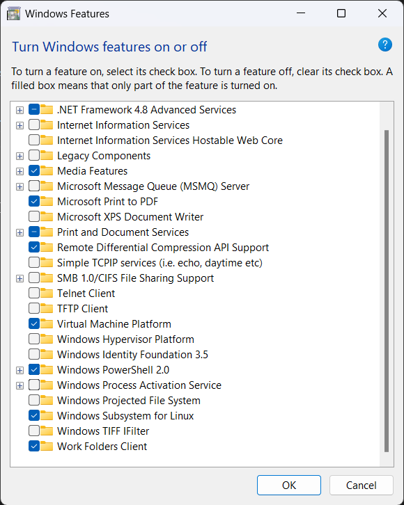
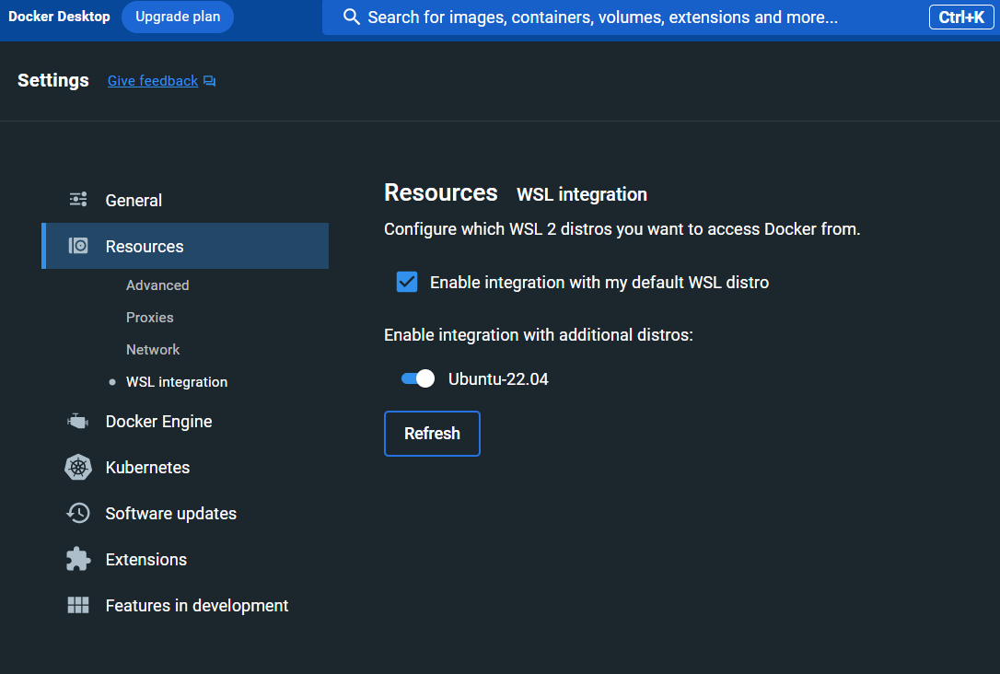

# OHP Allergy Module Chaincode

This is the **OHP Allergy chaincode module** and it is part of open source healthcare platform by IBM.

## WSL

### Quickstart Installation For Windows Subsystem for Linux (WSL)

If you already have working version of **Ubuntu-22.04 LTS** over WSL and then you can safely skip this step.

1. Installing WSL:
- Search Windows features in the search box and go to **Turn Windows features on or off**. Make sure you have the following options selected:


- Run **Powershell** as administrator and type the following:    `wsl --list --online`   for list of available distributions and use 
    `wsl --install -d <Distribution Name>`  to install desired distribution. In our case, use latest LTS version of Ubuntu. For more info regarding installing or unintsalling WSL on windows visit this [page](https://learn.microsoft.com/en-us/windows/wsl/install).

- Install latest version of Docker from this [website](https://www.docker.com/get-started/). Integrate the docker with WSL as following:
   - Run **Docker** after installation
   - Goto **Settings** and choose **Resources**
   - Under **Resources** select **WSL Integration** and turn *on* **Ubuntu-22.04**.
 
 


## Installing Minifab and its dependencies

### Installing Dependencies
- Run **Ubuntu-22.04 LTS** using windows search box.
- Do following steps to install and update dependecies
```
sudo apt install
sudo apt update
sudo apt upgrade
``` 
  - also this: 
```
sudo apt install git
sudo apt install curl
sudo apt install jq
```

### Installing Minifab

- Run **Ubuntu-22.04 LTS** and on home screen. Paste following command to get the script:
```
mkdir -p ~/mywork && cd ~/mywork && curl -o minifab -sL https://tinyurl.com/yxa2q6yr && chmod +x minifab
```
- Once installed, you can see a folder named **mywork** and it has executable script file named as **minifab**
- The layout of the folders should be `username/mywork/`
- Visit this [link](https://github.com/hyperledger-labs/minifabric/) for further information about minifab.

### Setting up minifab and its dependent folders
- Run docker in background
- Now Run Ubuntu and go to `/mywork` folder and invoke the minifab using:
```
./minifab up -i 2.4.9 -e true -s couchdb
```
- The following command can be used to tear down the fabric/network.
```
./minifab down
```
- The above command will create the whole minifab module in folder named `vars` therefore the structure should be `username/mywork/vars`

- **Important** `./minifab cleanup` will erase everything in the `/vars` folder so use it only when required. Also, for any help regarding minifab commands run the command `./minifab --help`

- You will see the followg structure of the folders
```
home/username/mywork/vars/
```
- `/vars` folder is read only, however we need to write few files into it. For that goto `/mywork` and type the following command to get full read and write access in all the files and folders inside `/mywork` folder.
```
sudo chmod -R 777 .
```

- Make the layout of the folders as following, you may need to create new folder(s)
```
home/username/mywork/vars/chaincode/allg/java
```
- Now copy everything from this github `/bch/java` (this current folder where the readme file is) and paste the files into above mentioned `/java` folder in Linux.


### Running minifab
- Go to `/mywork` folder and run the following command, if not already running, you can check through docker which should be running in the background:
```
./minifab up -i 2.4.9 -e true -s couchdb
```
Expected error in the above when running second time, this could be `non-zero return code` such as `/Channel/Application be at version 0, but it is currently at version 1` you can safely ignore this.

- Now run the following this may take few mins to run.()
```
./minifab ccup -n allg -l java -v 1.0 -d false
```
Similarly, if running second time you may get error as `non-zero return code` and `chaincode already successfully installed` you can safely ignore this as well.

- The set of following commands are to check if we can perform invoke, create or ping function on AllergyIntolerance module. Run them separately and aim for the green screen to ensure the system is working as expected. 

```
./minifab invoke -n allg -p '"AllergyIntolerance:getTemplate"'
./minifab invoke -n allg -p '"AllergyIntolerance:ping"'
```
- The following code tests the sample template and this is how we make sure the model can hold the values as expected
```
./minifab invoke -n allg -p '"AllergyIntolerance:create", "{\n \"identifier\":[],\n \"clinicalStatus\":[\n \"Some status\",\n \"allergy is imminent\"\n ],\n \"verificationStatus\":\"verified\",\n \"type\":[],\n \"category\":\"food\",\n \"criticality\":\"high\",\n \"code\":\"code123\",\n \"patient\":{\n \"type\": \"patient\",\n \"reference\":\"patientReference\",\n \"identifier\":\"patientIdentifier\"\n },\n \"encounter\": {\n \"type\":\"encounter\",\n \"reference\":\"2023-2-12\",\n \"identifier\":\"encounterIdentifier\"\n },\n \"onset\":{\n \"onsetDateTime\":\"2023-10-20\"\n },\n \"recordedDate\":\"2023-10-20\",\n \"lastOccurence\":\"2023-10-20\",\n \"participant\": [],\n \"reaction\":{\n \"description\": \"Allergic reaction description\"\n },\n \"documentType\": \"ALLERGYINTOLERANCE\",\n \"primaryIdentifier\":\"ident123\",\n \"dataHash\":\"hash123\",\n \"modifiedBy\":\"user123\"\n }"'
```

- To check if the above create function created the template, use the command below `find` command
```
./minifab invoke -n allg -p '"AllergyIntolerance:find", "ident123"'
```

- The set of following commands are to check if we can perform invoke, create or ping function on Condition module. Run them separately and aim for the green screen to ensure the system is working as expected. 

```
./minifab invoke -n allg -p '"Condition:getTemplate"'
./minifab invoke -n allg -p '"Condition:ping"'
```

- Similarly, we can use the following commands to create template for `Condition` module.
```
./minifab invoke -n allg -p '"Condition:create", "{\"identifier\":null,\"clinicalStatus\":\"active\",\"verificationStatus\":\"unconfirmed\",\"severity\":\"severe\",\"category\":\"problem-list-item\",\"code\":null,\"bodySite\":null,\"subject\":null,\"encounter\":null,\"onset\":null,\"abatement\":null,\"recordedDate\":null,\"participant\":null,\"Stage\":null,\"evidence\":null,\"note\":null,\"documentType\":\"CONDITION\",\"primaryIdentifier\":\"ident987\",\"dataHash\":\"hash\",\"modifiedBy\":\"user\"}"'
```
and also to find the created template using primary identifier:
```
./minifab invoke -n allg -p '"Condition:find", "ident987"'
```

### Visualising the transactions:
- Use `./minifab consoleup`, by default `username: admin` and `password: password`
- Delete already present identities or nodes.
- Goto settings and under 'Bulk data management' choose `import`
- Now import the `assets.zip` file from the directory `username/mywork/vars/console`
- Associate all the network nodes.
- Go to `channel --> mysite --> transactions overtime`, now you are able to see all the blockchain transactions.  

### Contributors 
Macquarie University PACE program *Team 50* Session 2, 2023 @https://github.com/orgs/ccode-asset/teams/asset-ohp-004-mq 
- K M Rakeen Abtahee
- Eshan Singh
- Qiuli Ji
- Alex Peng
- Ravi Inder Singh

